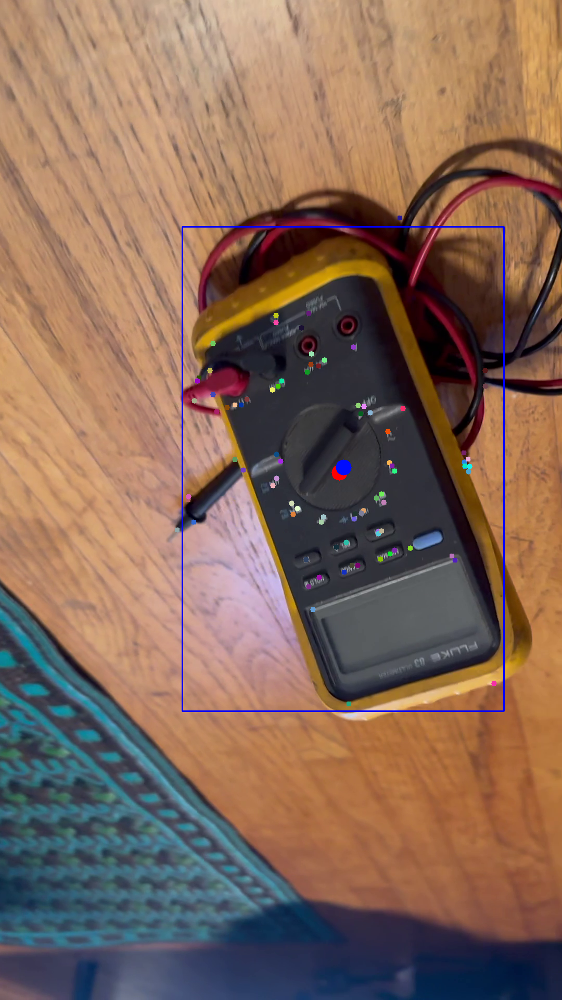

# CPE428 Final Project (Peanut Butter Project)

For our course project we attempted to create a solution for locating specific objects within a scene. This was done in two steps: first scanning an object to extract its features, and then looking for those features in a new image.

This project went through a number of different iterations which are not included in the report to keep is concise.

## Project setup

Run `./tools/setup_venv.sh` to install requirements and generate a virtual environment under *venv/*.

## Scanning stage

